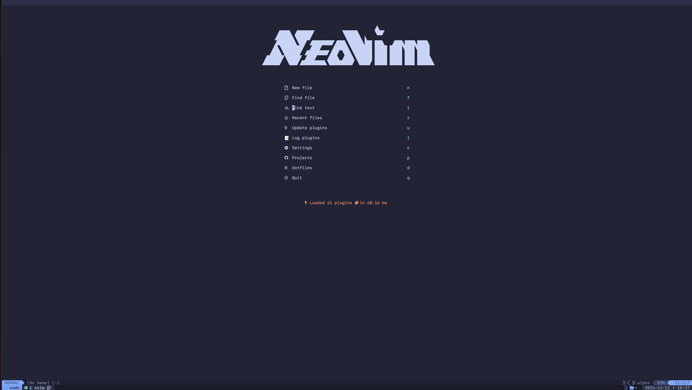
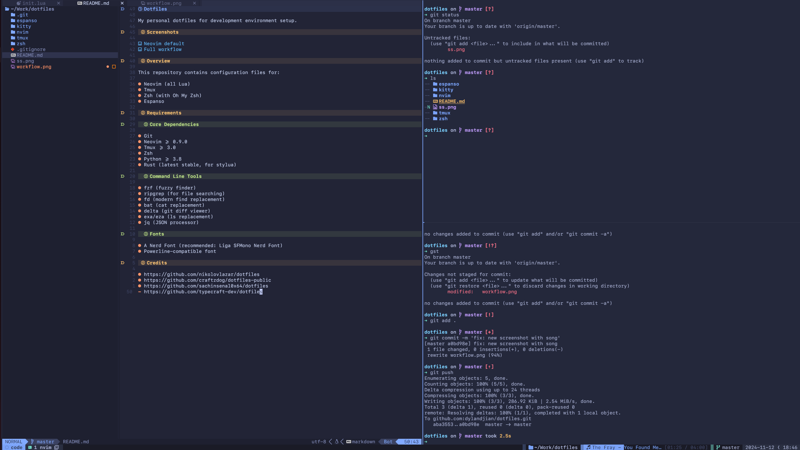

# Dotfiles

My personal dotfiles for my development environment setup.

## Screenshots

## Overview

This repository contains configuration files for:

- Neovim (all Lua)
- Tmux
- Zsh (with Oh My Zsh)
- Espanso

## Requirements

### Core Dependencies

- Git
- Neovim >= 0.9.0
- Tmux >= 3.0
- Zsh
- Python >= 3.8
- Rust (latest stable, for stylua)

### Command Line Tools

- fzf (fuzzy finder)
- ripgrep (for file searching)
- fd (modern find replacement)
- bat (cat replacement)
- delta (git diff viewer)
- exa/eza (ls replacement)
- jq (JSON processor)

### Fonts

- A Nerd Font (recommended: Liga SFMono Nerd Font)
- Powerline-compatible font

### TODO

- [ ] Make better crossplatform (MacOS / Linux compatibility)
- [ ] Script to remove custom tokens
- [ ] Add .gitconfig with delta config and theme
- [ ] Make the README clearer on the list of tools you need to install
- [ ] Fix bat theme for tokyonight, check https://github.com/folke/tokyonight.nvim/issues/23
- [ ] Fix tmux theme

## Credits

- https://github.com/nikolovlazar/dotfiles
- https://github.com/craftzdog/dotfiles-public
- https://github.com/sachinsenal0x64/dotfiles
- https://github.com/typecraft-dev/dotfiles
