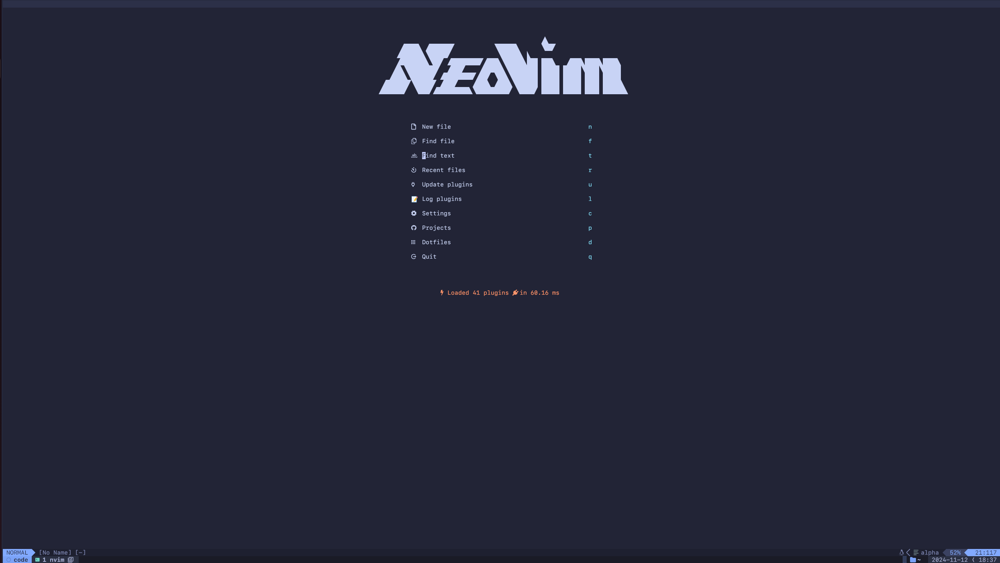
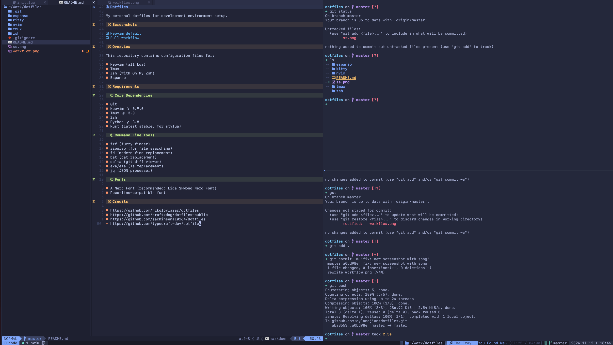

# Dotfiles

My personal dotfiles for my development environment setup.

## Screenshots




## Overview

This repository contains configuration files for:

- Neovim (all Lua)
- Tmux
- Zsh (with Oh My Zsh)
- Espanso

## Requirements

All of the below are installed automatically by `./deps.sh` on macOS,
and mostly automatically on Debian-based Linux (Raspberry Pi OS /
Ubuntu / Debian) — GUI apps and the Nerd Font need a manual install
on Linux for now.

### Core Dependencies

- Git
- Neovim >= 0.9.0
- Tmux >= 3.0
- Zsh
- Python >= 3.8
- Rust (latest stable, for stylua)

### Command Line Tools

- fzf (fuzzy finder)
- ripgrep (for file searching)
- fd (modern find replacement)
- bat (cat replacement)
- delta (git diff viewer)
- exa/eza (ls replacement)
- jq (JSON processor)

### Fonts

- A Nerd Font (recommended: Liga SFMono Nerd Font)
- Powerline-compatible font

## Installation

1. Clone into your preferred location:
   ```bash
   git clone https://github.com/dylandjian/dotfiles.git ~/Work/dotfiles
   cd ~/Work/dotfiles
   ```
2. Install dependencies (Homebrew/apt packages, Oh My Zsh + plugins,
   nvm, Rust, uv, nvim tooling). Idempotent — safe to re-run:
   ```bash
   ./deps.sh
   ```
3. Run the installer — it symlinks configs into place and backs up
   anything it would overwrite to `~/.dotfiles-backup-<timestamp>/`:
   ```bash
   ./install.sh
   ```
4. Private overrides (API keys, work-specific env) go in
   `~/.zshrc.local` — it's sourced at the end of `.zshrc` and gitignored.

### Syncing changes back

If you tweak a config in place (e.g., `~/.config/nvim`) and want to
pull it into the repo, run:

```bash
./sync.sh
```

It replaces the live file with a symlink to the repo copy and
auto-commits the change.

### TODO

- [ ] Full Linux parity (GUI apps + Nerd Font auto-install)
- [ ] Support non-apt Linux distros in `deps.sh` (dnf, pacman)
- [ ] Add .gitconfig with delta config and theme

## Credits

- https://github.com/nikolovlazar/dotfiles
- https://github.com/craftzdog/dotfiles-public
- https://github.com/sachinsenal0x64/dotfiles
- https://github.com/typecraft-dev/dotfiles
